# EEG-BCI-single-channel
# Single-Channel EEG Acquisition System
### AD620AN · TL074 · ESP32 · Brain-Computer Interface Research

> **B.Tech Final Year Project — Electrical & Electronics Engineering**
> Academy of Technology, Hooghly, West Bengal (MAKAUT), 2024–25
> Supervised by Dr. Smarajit Maiti and Prof. Jayanta Digar

---

## What this is

A low-cost, breadboard-prototype single-channel EEG (electroencephalography)
signal acquisition system, designed from first principles to capture scalp
electrical activity in the alpha band (8–13 Hz) and stream digitised samples
to a PC for real-time FFT-based spectral analysis.

This is a **research prototype**, not a medical device or finished product.
It is one arm of a larger project that includes a Proteus 9 circuit simulation,
Phase 1 human self-testing, and an accompanying survey paper on EEG-based
brain-computer interface paradigms. Everything here is documented at the level
of an engineering research record — including what failed, why, and what was
done about it.

---

## Motivation

Commercial EEG systems (OpenBCI, Emotiv, Muse) cost hundreds to thousands of
dollars and are inaccessible for low-resource research settings. The goal here
was to build a working EEG front-end from discrete components under a minimal
budget, understand every stage of the signal chain from first principles, and
use the hardware as an empirical grounding for a theoretical survey of BCI
paradigms.

The secondary motivation is the paper itself: most BCI surveys are written by
researchers who have never built the acquisition hardware. Building it first
changes what you write — and what you are honest about.

---

## Circuit Architecture

```mermaid
flowchart TD
    A(["🧠 Scalp — AgCl Electrodes\nA1 · A2 active earlobes · Fpz reference\nConductive gel · 10-20 International System"])
    B["🛡️ Protection Stage\nSeries resistors + low-leakage diodes\nLimits input current · Prevents ESD damage"]
    C["⚡ AD620AN — Instrumentation Amplifier\nGain: G = 49.4kΩ/Rg + 1\nCMRR > 100 dB · Rg = 500kΩ\nDifferential input → single-ended output"]
    D["🔧 TL074 — Quad Op-Amp\nPost-amplifier + filter driver\nGain: Gb = 1 + Rf/R1\nAdditional voltage gain stage"]
    E["〰️ 2nd-Order Passive Bandpass Filter\n0.5 Hz – 50 Hz\nFc = 1 / 2π√R1·R2·C1·C2\nPasses delta · theta · alpha · beta · gamma\nRejects DC drift + HF EMG noise"]
    F["🚫 Twin-T Notch Filter — 50 Hz\nPowerline interference rejection\nIndian grid frequency: 50 Hz\nPassive RC Twin-T topology"]
    G["⚖️ Bias Network — DC Offset Correction\n2 × 10kΩ voltage divider\n3.3V ESP32 rail → ~1.65V midpoint\nShifts bipolar TL074 output\ninto ESP32 ADC range 0–3.3V"]
    H["💻 ESP32 — 12-bit SAR ADC\nGPIO 34 · 0–3.3V · 4096 steps\n~100Hz sampling · 115200 baud\nUSB serial output to PC"]
    I[["📊 Python Signal Processing Pipeline\npyserial · NumPy FFT · pyqtgraph\nReal-time PSD · Alpha band visualisation"]]

    A --> B --> C --> D --> E --> F --> G --> H --> I

    style A fill:#2d6a4f,color:#fff,stroke:#1b4332
    style B fill:#374151,color:#fff,stroke:#1f2937
    style C fill:#1e3a5f,color:#fff,stroke:#1e40af
    style D fill:#1e3a5f,color:#fff,stroke:#1e40af
    style E fill:#4a1942,color:#fff,stroke:#6b21a8
    style F fill:#4a1942,color:#fff,stroke:#6b21a8
    style G fill:#7c2d12,color:#fff,stroke:#9a3412
    style H fill:#1e3a5f,color:#fff,stroke:#1e40af
    style I fill:#064e3b,color:#fff,stroke:#065f46
```



---

## Hardware Specifications

| Parameter | Value |
|---|---|
| Pre-amplifier | AD620AN instrumentation amplifier |
| Pre-amp gain equation | G = (49.4 kΩ / Rg) + 1 |
| Rg value | 500 kΩ |
| Post-amplifier | TL074 quad op-amp |
| Post-amp gain equation | Gb = 1 + (Rf / R1) |
| Total design gain target | ~10,000× (at EEG-level µV inputs) |
| Bench-verified gain | 140 mV differential → 608 mV output (signal generator test) |
| Passband | 0.5 Hz – 50 Hz |
| Filter type | 2nd-order passive RC bandpass |
| Filter cutoff equation | Fc = 1 / (2π × √(R1 × R2 × C1 × C2)) |
| Notch | 50 Hz Twin-T passive filter |
| ADC | ESP32 GPIO 34, 12-bit (0–4095), 0–3.3 V range |
| Sampling rate | ~100 Hz (10 ms loop delay) |
| Serial baud rate | 115200 |
| Bias offset | ~1.65 V (2 × 10 kΩ voltage divider from 3.3 V rail) |
| Electrode type | AgCl single-use (ECG type) with conductive gel |
| Electrode placement | A1/A2 active (earlobes), Fpz reference (10-20 system) |
| Prototype form | Breadboard (830-point) |

---

## Component List

| Component | Value / Part | Qty | Function |
|---|---|---|---|
| AD620AN | Instrumentation Amp | 1 | Pre-amplification, CMRR |
| TL074 | Quad Op-Amp | 1 | Post-amp + filter drive |
| Resistor | 1 kΩ | 2 | Filter / gain network |
| Resistor | 4 kΩ | 2 | Filter network |
| Resistor | 500 kΩ | 2 | Rg pin — sets AD620 gain |
| Resistor | 10 kΩ | 2 | Bias voltage divider (Phase 2) |
| Capacitor | 1 µF | 5 | Bandpass + notch filter |
| ESP32 | 30-pin DevKit | 1 | 12-bit ADC + USB serial |
| AgCl Electrodes | Single-use ECG type | 3 | Scalp signal acquisition |
| Breadboard | 830-point | 1 | Prototype platform |

---

## Proteus 9 Simulation

The full circuit was simulated in Proteus 9 before hardware assembly.

Simulation verified:
- AD620AN gain response across the target frequency range
- TL074 post-amplifier stage behaviour
- Passive bandpass filter cutoff at 0.5 Hz and 50 Hz
- Twin-T notch attenuation at exactly 50 Hz
- Signal chain output at expected amplitude for a representative EEG-scale input

The simulation schematic is in `/hardware/schematic.png`.

Proteus simulation does not model electrode-skin impedance, parasitic
capacitance on breadboard traces, powerline pickup through the physical
setup, or contact noise from AgCl electrodes. These are encountered in
hardware testing and are documented below.

---

## Human Testing — Phase 1

**Protocol:** Self-experimentation (subject: Debaditya Saha)
Self-experimentation is a recognised and widely used protocol in
pilot-phase BCI research. Farwell and Donchin (1988) used it in
the original P300 speller paper. It allows rapid iteration without
ethical review overhead during the circuit-validation stage.

**Electrode placement (10-20 International EEG System):**
- A1 — left earlobe (active)
- A2 — right earlobe (active)
- Fpz — forehead midline (reference)
- Conductive gel applied at all contact points
- Electrodes: AgCl single-use from ECG kit

**What was tested:**
Eyes-closed relaxation (alpha-promoting) versus eyes-open (alpha-suppressing)
states. Alpha rhythm (8–13 Hz) increases in amplitude during eyes-closed
relaxation and suppresses when the visual cortex is actively processing input.
This is the most robust and well-documented state-dependent EEG marker,
making it the appropriate first validation target for a new circuit.

**DSO observation:**
Oscillatory activity consistent with alpha-band rhythm (8–13 Hz) was observed
on the digital storage oscilloscope (DSO) during the eyes-closed condition.
This observation is qualitative — it was a visual identification of
oscillatory activity in the correct frequency range on the DSO display,
not a spectrally quantified FFT measurement.

DSO bench verification (signal generator, not EEG):
- Input: 140 mV differential
- Output: 608 mV
- Observed gain: 4.34× at this signal level (expected — signal generators
  operate at millivolt scale; full 10,000× design gain applies at microvolt
  EEG-level inputs where the gain equations are calibrated)

---

## Known Issue: ADC Clipping (Half-Wave Rectification)

This section documents the most significant engineering problem encountered
and the solution implemented. It is included in full because transparent
documentation of failure modes is part of serious hardware research.

### What was observed

During the first ESP32 digitisation session, the Arduino IDE Serial Plotter
output showed a near-flat line at ADC value = 0 for most of the recording,
with occasional brief positive spikes. The expected output was a small-amplitude
oscillating signal around a midpoint baseline.

### Root cause

The TL074 op-amp operates on a dual power supply and produces a bipolar output
signal — it swings both above and below 0 V.

The ESP32 ADC input accepts voltages in the range 0 V to 3.3 V (unipolar).

Any part of the TL074 output that goes below 0 V is outside the ESP32 ADC
range and is clipped to 0. The ADC only captures positive half-cycles of the
signal. This is half-wave rectification caused by a voltage domain mismatch
between the analog output stage and the digital input stage.

The brief positive spikes visible in the serial plotter are motion artifacts
from electrode contact adjustment during setup — large-amplitude, non-periodic
positive transients, not neural oscillations. True alpha oscillations would
appear as a sinusoidal waveform at 8–13 Hz riding on a stable baseline, not
as isolated spikes from a zero floor.

The serial plotter GIF is preserved in `/data/serial_plotter_raw.gif` as a
documented engineering record. The analysis file is at
`/data/serial_plotter_analysis.md`.

### Solution

A resistor-based DC bias network was added between the TL074 output
and the ESP32 ADC input:

```
TL074 output
     │
    10 kΩ
     │
     ├──────────── ESP32 GPIO 34 (ADC input)
     │
    10 kΩ
     │
  3.3 V rail (ESP32)
```

The voltage divider creates a ~1.65 V DC midpoint at the ADC input.
The bipolar AC EEG signal now rides on this 1.65 V baseline, keeping
the full waveform within the 0–3.3 V ADC input range.

The corrected firmware (`firmware/esp32_biased.ino`) reads the biased
signal and outputs voltage in volts rather than raw ADC counts,
making the serial plotter output directly interpretable.

Phase 2 validation of this correction is currently in progress.

---

## Software Pipeline

### Firmware (Arduino IDE → ESP32)

`firmware/esp32_adc.ino` — original sketch (pre-bias correction)
Reads GPIO 34, prints raw ADC counts (0–4095) at 115200 baud.

`firmware/esp32_biased.ino` — corrected sketch (Phase 2)
Reads GPIO 34, maps to voltage (0–3.3 V), prints 4 decimal places.
Includes `analogSetAttenuation(ADC_11db)` for full 0–3.3 V input range.

### PC-side (Python)

Dependencies:
```
pyserial
numpy
pyqtgraph
```

Install:
```bash
pip install pyserial numpy pyqtgraph
```

The Python pipeline reads serial output from the ESP32, buffers samples,
computes real-time FFT using NumPy, and displays both the time-domain
waveform and the power spectral density in pyqtgraph.

The alpha suppression experiment script (in `/data/`) records 30-second
epochs in eyes-closed and eyes-open conditions, computes FFT for both,
and plots the spectral comparison with the alpha band (8–13 Hz) highlighted.

---

## Current Status

| Phase | Task | Status |
|---|---|---|
| 1 | Circuit design (schematic) | Complete |
| 1 | Proteus 9 simulation | Complete |
| 1 | Hardware breadboard build | Complete |
| 1 | Signal generator bench test (DSO) | Complete — 140 mV → 608 mV |
| 1 | Electrode placement protocol | Complete |
| 1 | Human testing — DSO observation | Complete — alpha activity observed |
| 1 | ESP32 serial digitisation | Partial — ADC clipping issue identified |
| 2 | Bias correction design (2 × 10 kΩ) | Implemented |
| 2 | Bias correction validation | In progress |
| 2 | Python FFT alpha suppression experiment | In progress |
| 2 | Real-time pyqtgraph visualisation | In progress |
| — | Survey paper (6 paradigms) | Sections 1–4 complete, in progress |

---

## Repository Structure

```
eeg-bci-single-channel/
│
├── README.md                          ← this file
│
├── hardware/
│   ├── components.md                  ← full component list with specs
│   ├── schematic.png                  ← Proteus 9 simulation screenshot
│   └── breadboard.jpg                 ← physical prototype photograph
│
├── firmware/
│   ├── esp32_adc.ino                  ← original ADC sketch (Phase 1)
│   └── esp32_biased.ino               ← bias-corrected sketch (Phase 2)
│
├── data/
│   ├── serial_plotter_raw.gif         ← Phase 1 ADC output (clipping issue)
│   ├── serial_plotter_analysis.md     ← root cause diagnosis + fix
│   └── alpha_suppression_result.png   ← FFT result [Phase 2 — pending]
│
└── paper/
    └── abstract_draft.md              ← survey paper abstract
```

---

## Accompanying Survey Paper

**Title:** EEG-Based Brain–Computer Interfaces: A Hardware-Grounded Survey of Six Paradigms

**Status:** Manuscript in progress (Sections 1–4 complete)

**Abstract:** In `/paper/abstract_draft.md`

**What it covers:**

| Paradigm | Mechanism | Hardware Verdict |
|---|---|---|
| Motor imagery (ERD/ERS) | Mu/beta suppression over motor cortex | Requires C3 + C4 minimum — not capturable single-channel |
| P300 | Oddball-evoked positive deflection at ~300 ms | Hardware tolerant — single Pz electrode sufficient |
| SSVEP | Visual cortex entrainment to flicker frequency | Hardware tolerant — single Oz electrode sufficient |
| ERN / Error potentials | ACC response to perceived errors | Hardware tolerant — single FCz electrode |
| Imagined speech | Gamma-band temporal cortex signals | Fundamentally constrained — EEG bandwidth + spatial resolution insufficient |
| Hybrid / Passive BCIs | Combined paradigms / continuous state monitoring | Passive variant hardware tolerant; hybrid multiplies channel requirements |

**Novel contribution:** A six-axis hardware constraint taxonomy
(minimum bandwidth, minimum channel count, electrode placement specificity,
SNR tolerance, calibration burden, stimulus dependency) applied
cross-paradigm — the first systematic framework to evaluate BCI paradigm
feasibility against real acquisition hardware constraints, not benchmark
accuracy alone.

**Target venue:** IEEE Transactions on Neural Systems and Rehabilitation Engineering
**Backup:** Frontiers in Human Neuroscience
**Preprint:** arXiv eess.SP / cs.HC (planned before journal submission)

---

## Individual Contributions

This is a 5-member B.Tech Final Year Project.

Circuit design, Proteus simulation, hardware build, human testing protocol,
ADC debugging, bias correction, and survey paper authorship:
**Debaditya Saha**

Electrode preparation and session logistics during human trials:
Arghyadip Ghosh, Sujal Shaw

Literature review support:
Kousani Debnath

Simulation verification support:
Anindita Banerjee

---

## Supervision

**Dr. Smarajit Maiti** — Project Guide
Department of Electrical Engineering, Academy of Technology, Hooghly

**Prof. Jayanta Digar** — Project Co-Guide
Department of Electrical Engineering, Academy of Technology, Hooghly

---

## Disclaimer

This system is a university research prototype built for academic signal
chain experimentation. It has not undergone medical device certification
and is not suitable for clinical or diagnostic use. All human testing
was conducted under self-experimentation protocol by a project team member
in an academic research context.

---

## References

Wolpaw, J.R. et al. (2002). Brain-computer interfaces for communication and
control. *Clinical Neurophysiology*, 113(6), 767–791.

Farwell, L.A. & Donchin, E. (1988). Talking off the top of your head:
toward a mental prosthesis utilizing event-related brain potentials.
*Electroencephalography and Clinical Neurophysiology*, 70(6), 510–523.

Lawhern, V.J. et al. (2018). EEGNet: a compact convolutional neural network
for EEG-based brain-computer interfaces. *Journal of Neural Engineering*,
15(5), 056013.

Analog Devices. AD620 Low Cost, Low Power Instrumentation Amplifier.
Data Sheet. Rev. G.

Texas Instruments. TL07xx Low-Noise JFET-Input Operational Amplifiers.
Data Sheet. SLOS080P.
